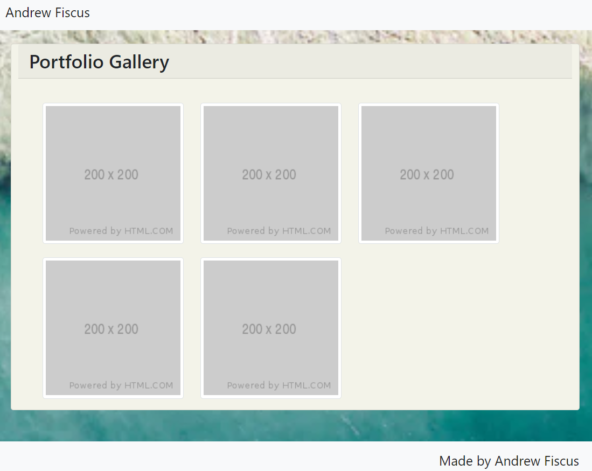

# Andrew-Fiscus-Portfolio

The purpose of this was to develop a webiste that was functional across multiple medias and is responsive.

1. The navbar that is across all three html files are connected and can be excessed by clicking the associated labeled button. When collapsed down into a smaller media, the navbar buttons gets replaced by a dropdown menu that is still functional.
2. While this page is still a work in process and does not contain images of any portfolio projects, I have filled placeholder images on the portfolio page to demonstrate how it may look once there images to be placed there.
   
